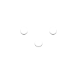

 
 

 

**The home of the Brock University Computer Science Club on the web.**
A community of 900+ students who code, connect, and create together.

 

 

## What lives here

A single Next.js app that carries the club's public face and the tools the execs use to run it — wrapped in a bold, neubrutalist design language of flat colour, thick black outlines, and hard offset shadows.

<table width="100%">
  <tr>
    <td width="90" align="center" valign="top">🏠</td>
    <td valign="top">
      <strong>Home</strong> 
      A punchy hero intro, an avatar wall of the current exec team, and a live preview of the next two upcoming events — the club at a glance.
    </td>
  </tr>
  <tr>
    <td align="center" valign="top">📅</td>
    <td valign="top">
      <strong>Events</strong> 
      A real scheduling engine. One-off <em>and</em> recurring events (weekly, biweekly, and monthly with specific weekday rules) are computed live against a Toronto-timezone clock, sorted into ongoing, upcoming, and past — with past events neatly grouped by academic term.
    </td>
  </tr>
  <tr>
    <td align="center" valign="top">🧑‍🤝‍🧑</td>
    <td valign="top">
      <strong>Team</strong> 
      The people behind the club. Current execs auto-sort by role priority (President → VP → Co-President → Treasurer → Executive), alongside an alumni wall celebrating past executives with their bios and socials.
    </td>
  </tr>
  <tr>
    <td align="center" valign="top">📚</td>
    <td valign="top">
      <strong>CS Guide</strong> 
      An open-source, student-written field guide to Brock Computer Science — course codes, credit types, program requirements, and campus resources — navigated by a scrollspy sidebar that tracks your place as you read.
    </td>
  </tr>
  <tr>
    <td align="center" valign="top">🔗</td>
    <td valign="top">
      <strong>Links</strong> 
      A tidy quick-link hub pointing to Discord, Instagram, GitHub, LinkedIn, and ExperienceBU — everything the club is, one tap away.
    </td>
  </tr>
  <tr>
    <td align="center" valign="top">🛠️</td>
    <td valign="top">
      <strong>Admin CMS</strong> 
      A Keycloak-gated dashboard where execs manage events and team members without ever touching the database directly.
    </td>
  </tr>
</table>

 

## Design language

Everything you see follows one idea: **neubrutalism**. Solid flat fills, thick black outlines, and hard drop shadows offset in brand red (`#9A4440`) or black — no gradients, no blur, no glow. Buttons and badges press down when you touch them, cards lift on hover, and a floating member badge bobs gently, so the whole site feels alive without ever getting fussy.

 

## Come say hi

 

Built by students, for students · Running on a self-hosted VPS via Komodo

